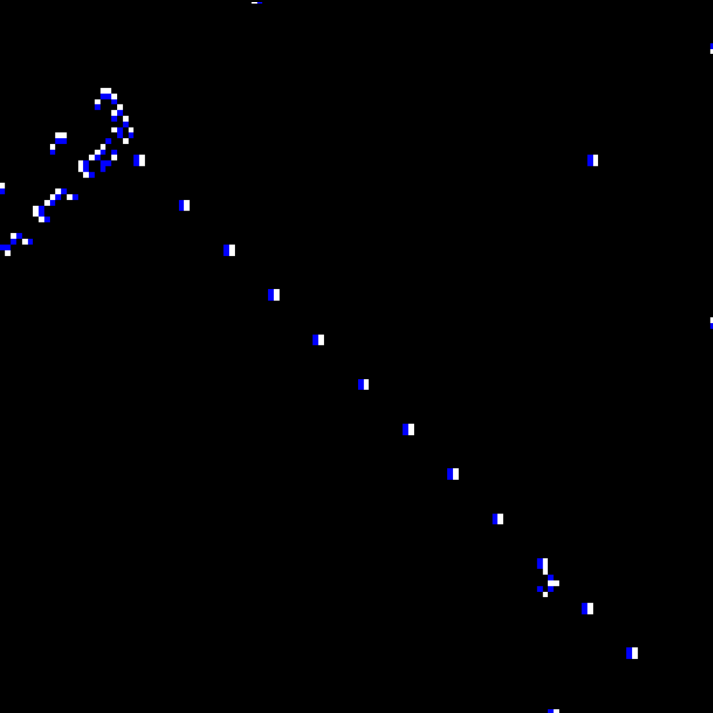
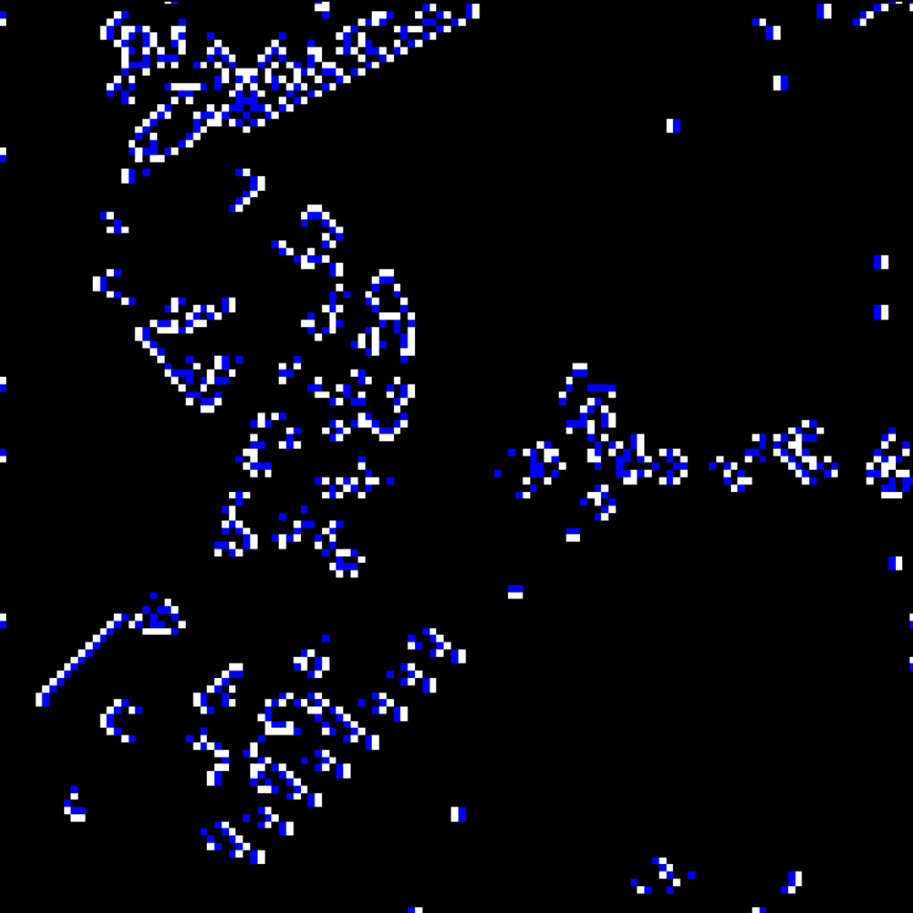
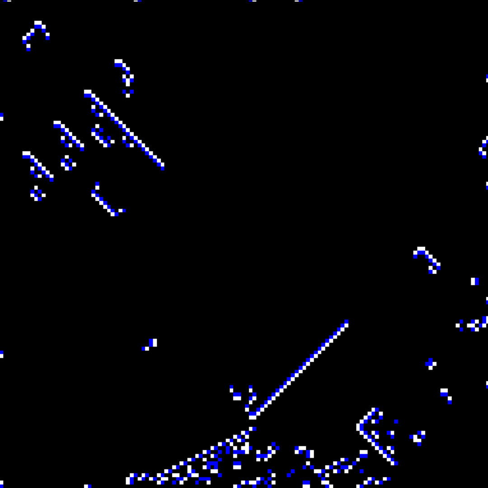

# Cellular Automata with Shaders
A display of cellular automata done with shaders in Unity. Hosted at https://peroshki.github.io/Cellular-Automata-with-Shaders/

The rulset used for the cellular automata is commonly known as Brian's Brain.

## Brian's Brain (from Wikipedia)
Brian's Brain is a cellular automaton devised by Brian Silverman.

It consists of a two-dimensional grid of cells, where each cell may be in one of three states: alive, dying, or dead.

A cells "neighbourhood" consists of all of the cells which are adjacent to it (its "neighbours").

The rules are as follows:
* A dead cell becomes alive if it has exactly two live neighbors
* A live cell becomes a dying cell
* A dying cell becomes a dead cell

## Screenshots

